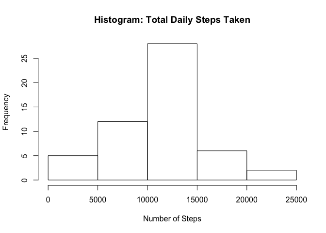
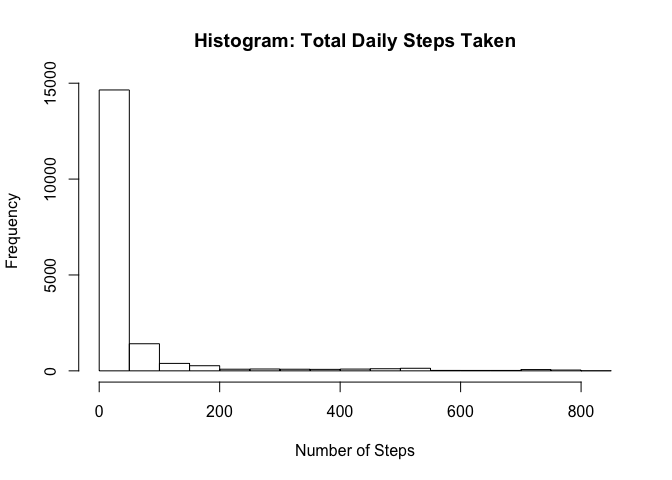
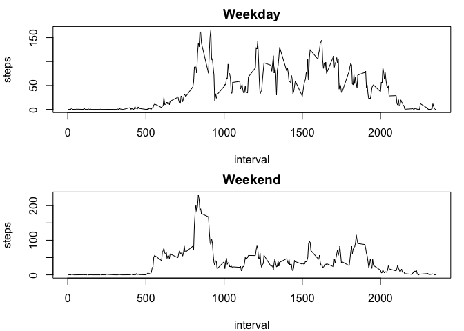

# Reproducible Research: Peer Assessment 1


## Loading and preprocessing the data

We will first unzip the file, then load the unzipped csv into "dat"


```r
unzip("activity.zip")
dat <- read.csv("activity.csv")
```

## What is mean total number of steps taken per day?

We will use the "aggregate" function to look at the total number of steps on each day.  
Then we will make a histogram of the total number of steps taken each day.
Lastly, we will calculate the mean and median of the total number of steps per day (and remove NAs).


```r
totalsteps <- aggregate(dat$steps, by = list(dat$date), sum)
totalsteps_mean <- mean(totalsteps[, 2], na.rm = TRUE)
totalsteps_median <- median(totalsteps[, 2], na.rm = TRUE)
```

We will now create the histogram:

```r
hist(totalsteps[, 2], xlab = "Number of Steps", main = "Histogram: Total Daily Steps Taken")
```

 

The mean number of steps taken per day is:

```r
totalsteps_mean
```

```
## [1] 10766.19
```

The median number of steps taken per day is:

```r
totalsteps_median
```

```
## [1] 10765
```

## What is the average daily activity pattern?

We will first calculate the average number of steps taken, averaged across all days.


```r
avgsteps <- aggregate(steps ~ interval, dat, mean)
```

Then we plot the time series graph:


```r
plot(avgsteps, type = "l")
```

 

To find the 5-minute interval with the maximum number of steps, we order the "avgsteps" data frame based on steps and retrieve the first row:


```r
avgsteps[with(avgsteps, order(-avgsteps$steps)), ][1, ]
```

```
##     interval    steps
## 104      835 206.1698
```

The interval with the maximum number of steps is 835.

## Imputing missing values

The total number of rows with NAs is calculated by the following:


```r
length(dat$steps[dat$steps == "NA"])
```

```
## [1] 2304
```

There are 2,304 missing values in the dataset.

For imputing missing values, we are going to replace the existing NAs with the mean for that 5-minute interval (which we already calculated for the previous question).  
In order to do so, we are going to create a new data frame "steps_new" and fill in its values with steps value from existing data (if available) and the average steps for that 5-minute interval (if not available).  
Then we are going to bind "steps_new" into the existing "dat" data frame. And then we will delete the old steps column and keep the new one (from "steps_new")


```r
steps_new <- data.frame()
for (i in 1:nrow(dat)) {
       if (is.na(dat[i, 1]) == TRUE) {
                steps_new[i, 1] <- avgsteps$steps[avgsteps$interval == dat[i, 3]]
       } else {
                steps_new[i, 1] <- dat[i, 1]
       }
}
dat <- cbind(steps_new, dat)
dat <- dat[,c(1,3,4)]
```

We will now create the histogram:

```r
hist(dat[, 1], xlab = "Number of Steps", main = "Histogram: Total Daily Steps Taken")
```

 

Then calculate the new mean and the new median:


```r
totalsteps_new <- aggregate(dat$V1, by = list(dat$date), sum)
totalsteps_mean_new <- mean(totalsteps_new[, 2], na.rm = TRUE)
totalsteps_median_new <- median(totalsteps_new[, 2], na.rm = TRUE)
```

Here's the new mean:

```r
totalsteps_mean_new
```

```
## [1] 10766.19
```

And the new median:

```r
totalsteps_median_new
```

```
## [1] 10766.19
```

Both the new mean and the new median equal to 10,766.19, which is also the original mean.  
Thus, the impact of imputing missing data on the estimates of the total daily number of steps is minimal.

## Are there differences in activity patterns between weekdays and weekends?

run a for loop to determine whether a day falls on weekday or weekend and then assign the value

We are going to first convert the dates into POSIXct format. 


```r
dat[, 2] <- as.POSIXct(dat[, 2])
```

Then we are going to create a new column in the "dat" data frame to see whether each row falls on a weekday or a weekend, using the same "cbind" approach we used earlier to create "steps_new".


```r
weekday <- data.frame()
for (i in 1:nrow(dat)) {
        if (weekdays(dat[i, 2]) == "Saturday" | weekdays(dat[i, 2]) == "Sunday") {
                weekday[i, 1] <- "weekend"
        } else {
                weekday[i, 1] <- "weekday"
        }
}
dat <- cbind(weekday, dat)
```

Now we are going to split the data into two lists, one for weekday and weekend, then measure the average steps for each interval for each list.


```r
colnames(dat) <- c("weekday", "steps", "date", "interval")
dat <- split(dat, dat[, 1])
avgsteps_weekday <- aggregate(steps ~ interval, dat[[1]], mean)
avgsteps_weekend <- aggregate(steps ~ interval, dat[[2]], mean)
```

Now we will plot the graph of average steps taken per interval, one for weekdays and one for weekends:


```r
par(mfrow = c(2, 1), mar = c(4,4,2,1))
plot(avgsteps_weekend, type = "l", main = "Weekday")
plot(avgsteps_weekday, type = "l", main = "Weekend")
```

 
